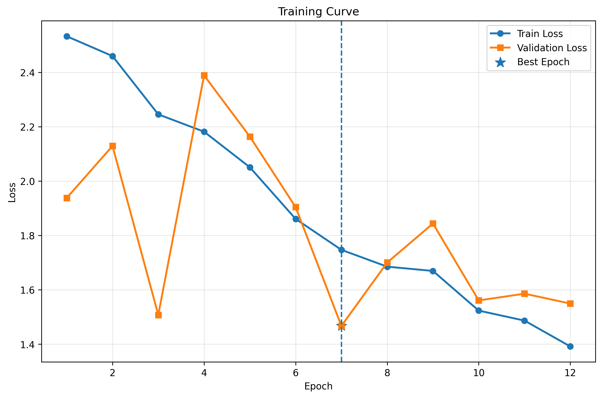
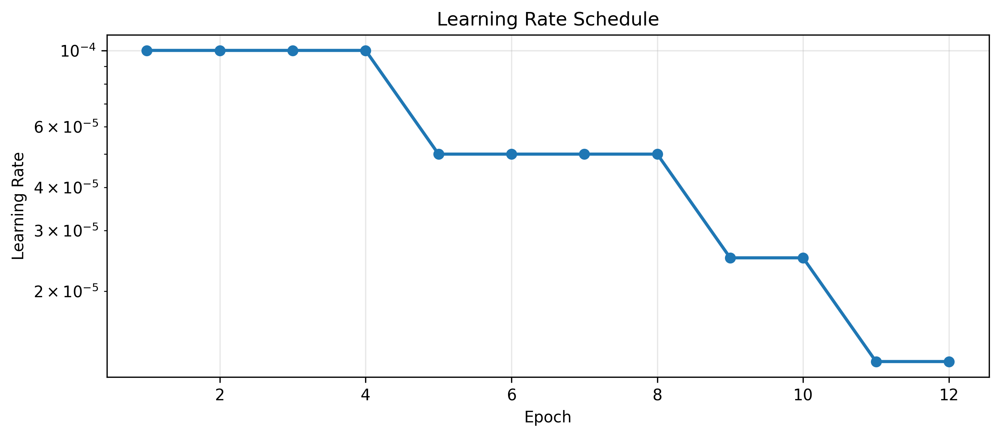
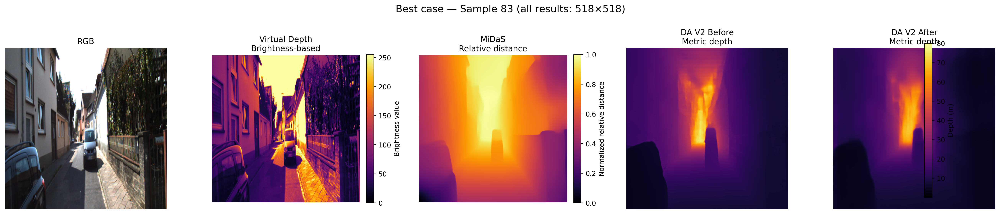
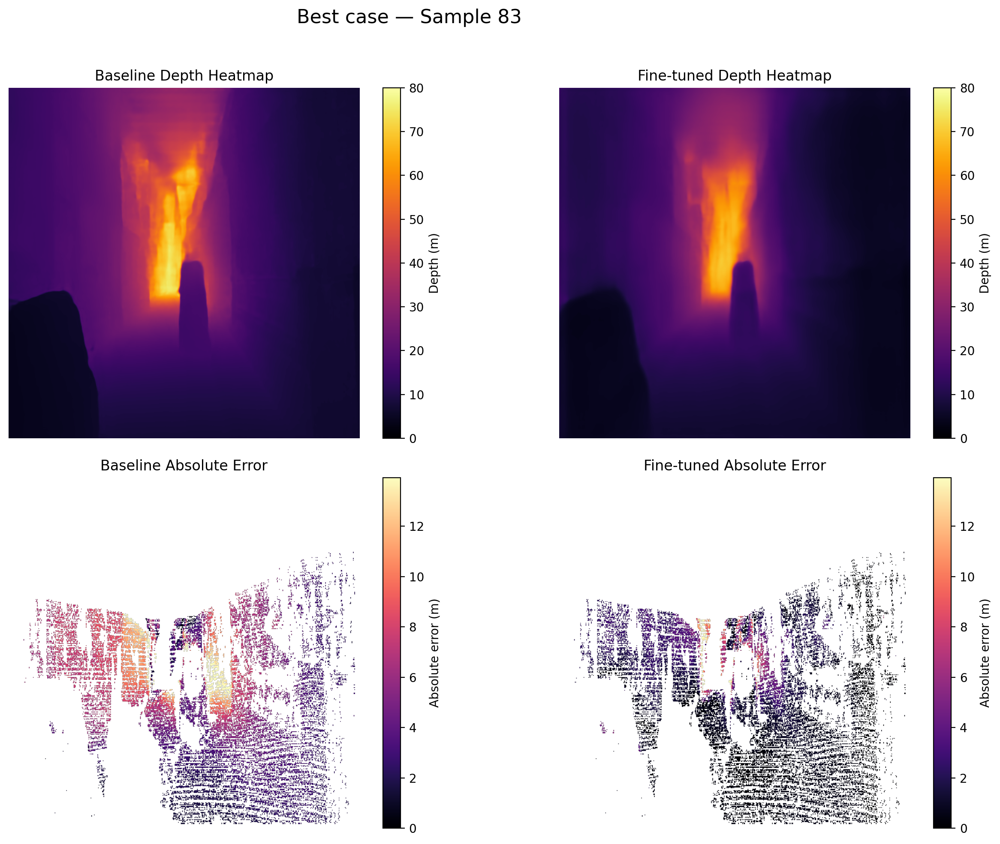
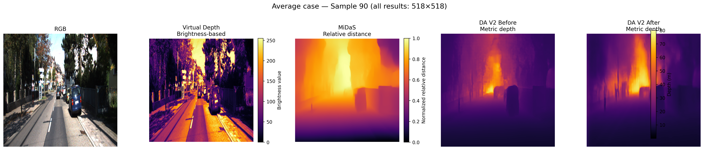
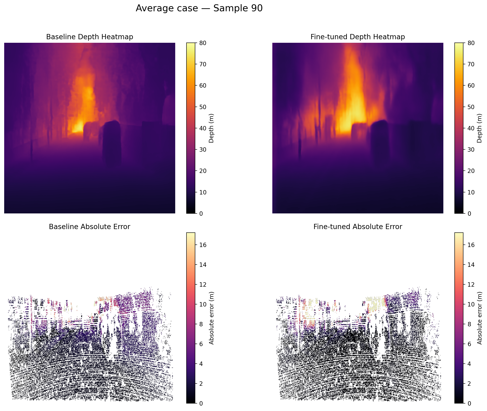
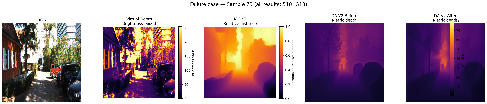
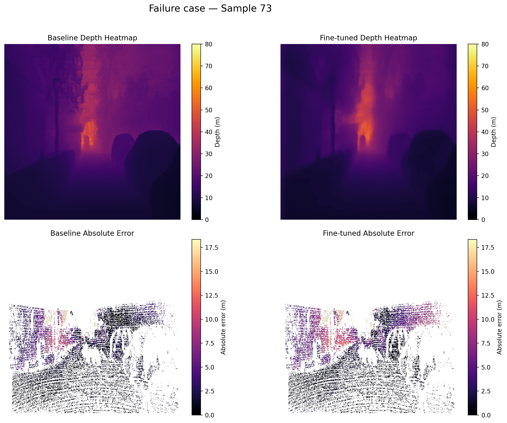
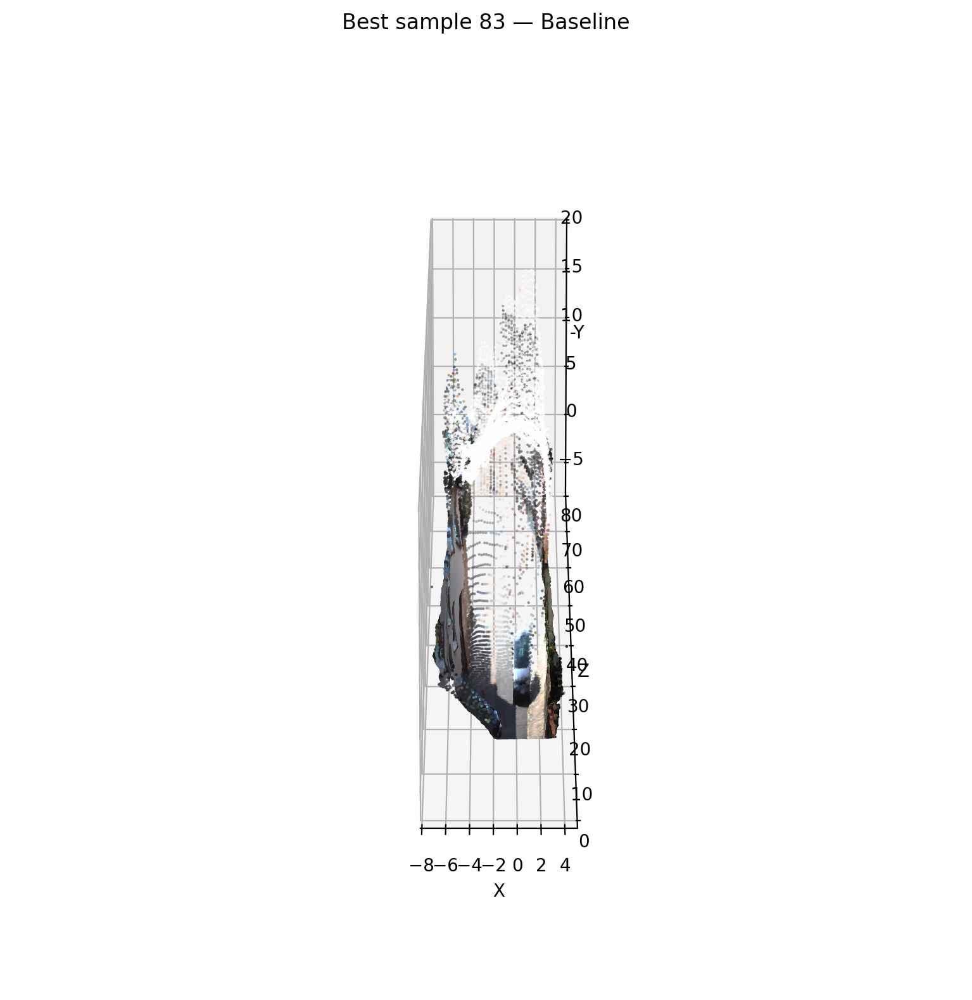
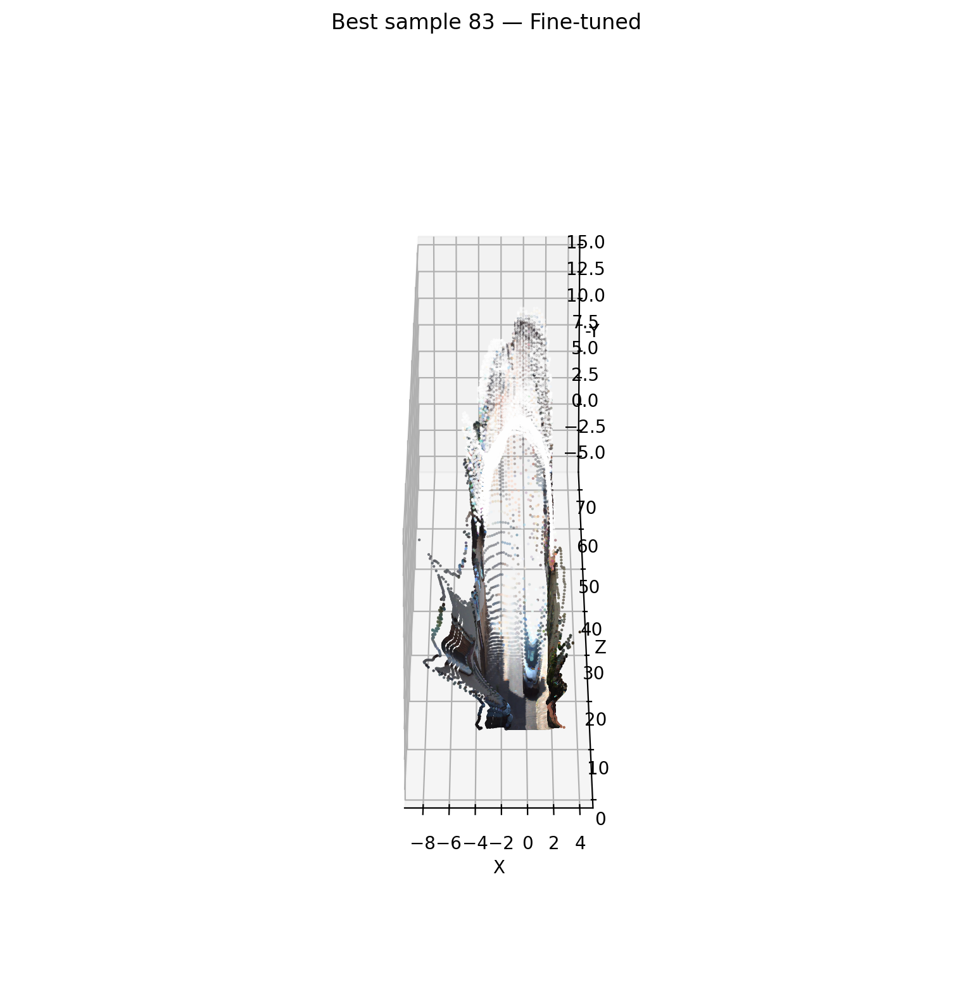

# Object-aware Metric Depth Estimation

<p align="center">
  <b>Fine-tuned Depth Anything V2 + YOLOv8n + Streamlit</b>
</p>

<p align="center">
  단일 RGB 이미지에서 metric depth를 추정하고,<br>
  탐지된 객체별 예측 깊이를 제공하는 웹 기반 컴퓨터 비전 시스템
</p>

<p align="center">
  
  
  
  
  
  
</p>

---

## 1. Project Overview

본 프로젝트는 단안 RGB 이미지에서 깊이를 추정하는  
**Depth Anything V2 metric depth 모델을 KITTI 데이터셋에 fine-tuning**하고,
도메인 적응 전후의 성능을 정량적·정성적으로 비교한 프로젝트입니다.

추가로, 이전 단계에서 학습한 **YOLOv8n 객체 탐지 모델**을 결합하여
탐지 객체마다 bounding box 내부의 대표 깊이를 계산하는
**Object-aware Metric Depth Estimation 시스템**을 구현했습니다.

최종 결과는 Streamlit 웹 애플리케이션으로 구성했으며 다음 정보를 제공합니다.

- 입력 원본 이미지
- Metric depth heatmap
- 객체 bounding box
- 객체 클래스 및 YOLO confidence
- 객체별 추정 깊이
- 전체 깊이 통계와 분포
- 모델별 추론 시간

> [!IMPORTANT]
> 객체별 깊이는 실제 거리 센서로 측정한 값이 아니라,
> fine-tuned Depth Anything V2가 예측한 depth map에서 계산한 추정값입니다.

---

## 2. Project Goals

1. KITTI 환경에서 Depth Anything V2 baseline 성능 측정
2. KITTI fine-tuning을 통한 metric depth 추정 성능 개선
3. 동일한 평가 조건에서 baseline과 fine-tuned 모델 비교
4. Virtual Depth, MiDaS 및 Depth Anything V2 결과의 정성 비교
5. Heatmap 및 pseudo point cloud를 이용한 깊이 구조 시각화
6. YOLOv8n과 depth estimation을 결합한 웹 응용 시스템 구현

---

## 3. System Pipeline

```text
Input RGB Image
        │
        ├──────────────────────────────────────┐
        │                                      │
        ▼                                      ▼
Fine-tuned Depth Anything V2               YOLOv8n
        │                               Object Detection
        ▼                                      │
Metric Depth Map                               │
        │                                      │
        └──────────────┬───────────────────────┘
                       ▼
          Bounding Box Region Sampling
                       │
                       ▼
       Median Depth of Central BBox Region
                       │
                       ▼
         Object-aware Depth Visualization
                       │
                       ▼
               Streamlit Web App
```

객체별 깊이는 bounding box 전체가 아니라 중앙 영역의 유효 depth 값에 대해
중앙값을 계산하여 추정합니다. 이는 bounding box 가장자리에 포함된
배경 픽셀의 영향을 줄이기 위한 처리입니다.

---

## 4. Methods

### 4.1 Virtual Depth

RGB 이미지를 grayscale로 변환한 뒤 밝기값을 가상의 깊이값으로 사용했습니다.

이 방식은 구현이 단순하지만 다음과 같은 한계가 있습니다.

- 밝은 객체를 먼 영역으로 잘못 해석할 수 있음
- 그림자와 조명 변화에 민감함
- 장면의 실제 기하 구조를 반영하지 못함
- Metric depth를 제공하지 않음

### 4.2 MiDaS

MiDaS를 zero-shot relative depth baseline으로 사용했습니다.

MiDaS는 장면의 상대적인 공간 구조를 표현할 수 있지만,
출력값이 실제 거리 단위의 metric depth는 아닙니다.

### 4.3 Depth Anything V2 Baseline

사전 학습된 Depth Anything V2 metric depth 모델을
추가 학습 없이 KITTI test set에 적용했습니다.

### 4.4 KITTI Fine-tuning

KITTI 데이터셋을 사용하여 Depth Anything V2를 fine-tuning했습니다.

- Backbone 고정
- Neck 및 depth head 학습
- Train/validation 분리
- Early stopping 적용
- Validation loss 기준 best checkpoint 저장
- 동일 test set에서 baseline과 fine-tuned 모델 재평가

### 4.5 Object-aware Depth Estimation

YOLOv8n으로 객체를 탐지한 뒤,
각 bounding box 중앙 영역에 대응하는 depth map 값의 중앙값을 계산했습니다.

```text
Object Depth
= Median depth within the central region of the bounding box
```

---

## 5. Dataset

### KITTI Eigen Split

Depth Anything V2의 fine-tuning과 평가에는 KITTI Eigen split을 사용했습니다.

- RGB image
- Sparse ground-truth depth
- Metric depth evaluation
- 최대 평가 깊이: 80 m

데이터셋은 용량 및 배포 조건을 고려하여 본 저장소에 포함하지 않았습니다.

---

## 6. Fine-tuning Setup

| 항목 | 설정 |
|---|---|
| Base model | Depth Anything V2 Metric |
| Dataset | KITTI Eigen Split |
| Input size | 518 × 518 |
| Trainable modules | Neck and depth head |
| Frozen module | Backbone |
| Optimizer | AdamW |
| Initial learning rate | 1e-4 |
| Maximum epochs | 20 |
| Early stopping patience | 5 |
| Best epoch | 7 |
| Best validation loss | 1.4669 |

학습 가능한 파라미터는 전체 파라미터의 약 11.01%였습니다.

```text
Total parameters     : 24,785,089
Trainable parameters :  2,728,513
Frozen parameters    : 22,056,576
```

---

## 7. Training History

<p align="center">
  
</p>

Train loss는 지속적으로 감소했으며 validation loss는 epoch 7에서 최저값을 기록했습니다.
이후 train loss는 감소했지만 validation 성능은 추가로 개선되지 않아
early stopping이 적용되었습니다.

<details>
<summary><b>Learning-rate schedule 보기</b></summary>

<br>

<p align="center">
  
</p>

</details>

---

## 8. Quantitative Results

Baseline과 fine-tuned 모델은 동일한 test set 100개와
동일한 518 × 518 평가 조건에서 비교했습니다.

| Metric | DA V2 Before | DA V2 After | Improvement |
|---|---:|---:|---:|
| MAE ↓ | 2.9401 | **1.8775** | **36.14%** |
| RMSE ↓ | 5.3390 | **4.0795** | **23.59%** |
| AbsRel ↓ | 0.1749 | **0.0932** | **46.70%** |
| SqRel ↓ | 1.0130 | **0.5622** | **44.50%** |
| δ1 ↑ | 0.7656 | **0.9042** | **18.10%** |
| δ2 ↑ | 0.9412 | **0.9789** | **4.01%** |
| δ3 ↑ | 0.9848 | **0.9948** | **1.01%** |

Fine-tuning 후 모든 평가 지표에서 성능이 개선되었습니다.

특히:

- AbsRel 약 46.70% 감소
- SqRel 약 44.50% 감소
- MAE 약 36.14% 감소
- δ1 약 18.10% 증가

세부 결과는 다음 파일에서 확인할 수 있습니다.

```text
outputs/finetuned_evaluation/baseline_vs_finetuned_518.csv
```

---

## 9. Qualitative Results

대표 사례는 baseline 대비 fine-tuned 모델의 개선 정도에 따라 선정했습니다.

| Category | Sample index | 의미 |
|---|---:|---|
| Best | 83 | Fine-tuning 개선이 크게 나타난 사례 |
| Average | 90 | 전체적인 평균 개선 경향과 유사한 사례 |
| Failure | 73 | 개선이 제한적이거나 어려움이 남은 사례 |

### Best Case — Sample 83

<p align="center">
  
</p>

각 방법의 출력값은 동일한 의미를 갖지 않습니다.

- Virtual Depth: 밝기 기반 가상 깊이
- MiDaS: 정규화된 상대 깊이
- DA V2 Before/After: Metric depth
- DA V2 Before와 After만 동일 단위와 범위에서 직접 비교 가능

### Baseline vs Fine-tuned Heatmap

<p align="center">
  
</p>

<details>
<summary><b>Average 및 Failure 사례 보기</b></summary>

<br>

#### Average Case — Sample 90

<p align="center">
  
</p>

<p align="center">
  
</p>

#### Failure Case — Sample 73

<p align="center">
  
</p>

<p align="center">
  
</p>

</details>

---

## 10. Pseudo Point Cloud Visualization

예측된 depth map을 근사 카메라 내부 파라미터를 사용해
pseudo point cloud로 변환했습니다.

<p align="center">
  
  
</p>

| Left | Right |
|---|---|
| DA V2 Before | DA V2 After |

> [!NOTE]
> Calibration 정보를 사용한 정밀 3D reconstruction이 아니라,
> 예측 depth 구조를 정성적으로 확인하기 위한 pseudo point cloud입니다.

---

## 11. Streamlit Application

Streamlit 웹 애플리케이션은 다음 기능을 제공합니다.

- 이미지 업로드
- YOLO confidence threshold 조절
- Bounding box depth sampling 비율 조절
- Fine-tuned Depth Anything V2 추론
- YOLOv8n 객체 탐지
- Metric depth heatmap 생성
- 클래스, confidence 및 객체별 추정 깊이 표시
- 탐지 객체 상세표 생성
- Depth histogram 출력
- Depth, YOLO 및 전체 처리 시간 표시

앱 출력 구성:

```text
Original Image
│
├── Depth Heatmap
│
├── Detection + Estimated Object Depth
│
├── Detected Object Table
│
└── Depth Distribution and Inference Time
```

> [!CAUTION]
> 표시되는 객체별 depth는 모델의 예측값입니다.
> 안전 제어, 자율주행 또는 실제 거리 측정 목적으로 사용해서는 안 됩니다.

---

## 12. Repository Structure

```text
.
├── outputs/
│   ├── finetuned_evaluation/
│   │   ├── baseline_vs_finetuned_518.csv
│   │   ├── representative_heatmaps/
│   │   └── representative_point_clouds/
│   │
│   ├── relative_depth_comparison/
│   │   └── final_comparisons/
│   │
│   └── training_figures/
│
├── scripts/
│   ├── 01_baseline.py
│   ├── 02_finetuning.py
│   ├── 03_evaluation_visualization.py
│   ├── 04_relative_depth_comparison.py
│   └── 05_streamlit_run.py
│
├── streamlit_app/
│   ├── app.py
│   ├── config.py
│   ├── inference.py
│   ├── model_loader.py
│   └── visualization.py
│
├── utils/
│   ├── __init__.py
│   ├── config.py
│   ├── dataset.py
│   ├── inference.py
│   ├── initialization.py
│   ├── metrics.py
│   ├── training.py
│   └── visualization.py
│
├── .gitignore
└── README.md
```

---

## 13. Installation

### Clone repository

```bash
git clone <REPOSITORY_URL>
cd comento-week4
```

### Install dependencies

```bash
pip install -r requirements.txt
```

---

## 14. Model Checkpoints

모델 체크포인트는 파일 크기로 인해 저장소에 포함하지 않습니다.

다음 구조로 체크포인트를 준비해야 합니다.

```text
checkpoints/
├── depth/
│   └── best_model.pt
└── yolo/
    └── best.pt
```

`streamlit_app/config.py`에서 실제 체크포인트 경로를 설정합니다.

```python
DEPTH_CHECKPOINT_PATH = (
    PROJECT_ROOT
    / "checkpoints"
    / "depth"
    / "best_model.pt"
)

YOLO_CHECKPOINT_PATH = (
    PROJECT_ROOT
    / "checkpoints"
    / "yolo"
    / "best.pt"
)
```

---

## 15. Run Streamlit App

```bash
streamlit run streamlit_app/app.py
```

Colab 환경에서는 다음 실행 스크립트를 참고할 수 있습니다.

```text
scripts/05_streamlit_run.py
```

Colab iframe에서 실행하기 위해 CORS 및 XSRF 보호를 비활성화한 설정은
개발 테스트용입니다. 실제 공개 배포에서는 해당 보안 설정을 그대로 사용하지 않아야 합니다.

---

## 16. Limitations

- KITTI 기반 fine-tuning으로 인해 다른 카메라 및 장면에서 성능이 저하될 수 있음
- 학습 및 평가 데이터 수가 제한적임
- KITTI ground truth가 sparse depth라는 한계가 있음
- Bounding box 안에 배경 영역이 포함될 수 있음
- 객체별 depth는 instance mask가 아닌 bbox 중앙 영역에서 계산됨
- Point cloud는 calibration 기반의 정밀 3D reconstruction이 아님
- 단일 이미지 추론이므로 시간적 일관성을 고려하지 않음
- 객체 탐지 성능은 YOLOv8n의 학습 클래스와 데이터 분포에 의존함


---

## 17. Tech Stack

- Python
- PyTorch
- Transformers
- Depth Anything V2
- YOLOv8n
- OpenCV
- NumPy
- pandas
- Matplotlib
- Plotly
- Streamlit
- KITTI Dataset
